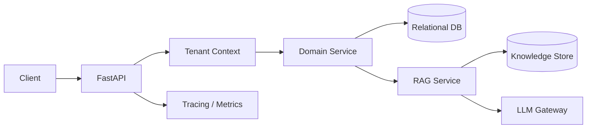

# AI SaaS Backend Showcase

> **Sanitized engineering portfolio.** This project is a genericized public reference based on patterns used in private SaaS systems. It contains no customer data, proprietary workflows, production credentials, internal domains, or production infrastructure identifiers.

A compact **multi-tenant AI-enabled SaaS backend** showing explicit tenant isolation, FastAPI API design, domain modeling, retrieval-oriented architecture, and automated tests.

## What this demonstrates

- FastAPI service architecture with a relational persistence path
- Explicit multi-tenant row scoping
- Tenant-aware CRUD endpoints
- RAG-oriented domain model and architecture
- Separation of retrieval, API, persistence, and observability concerns
- Automated tests for tenant isolation

## Architecture



## Security boundary

Every tenant-owned query is scoped explicitly. The sample keeps the rule visible so reviewers can inspect it directly:

```python
select(Matter).where(
    Matter.tenant_id == tenant.id,
    Matter.id == matter_id,
)
```

## Run locally

```bash
python -m venv .venv
source .venv/bin/activate   # Windows: .venv\Scripts\activate
pip install -r requirements.txt
uvicorn app.main:app --reload
```

The public sample uses synthetic in-memory data so reviewers can inspect the tenant boundary without environment setup. Production implementations use relational persistence and vector retrieval behind the same service boundary.

## Repository layout

```text
app/
  main.py
  models.py
  tenancy.py
tests/
  test_tenant_isolation.py
docs/
  architecture.md
```

## Privacy

All identifiers and data are synthetic. No production prompts, keys, customer records, endpoints, or company-specific business logic are included.
